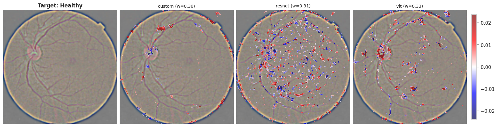
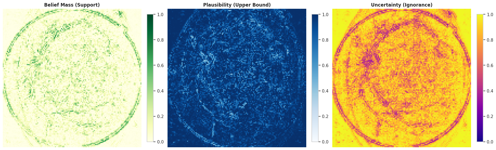

# UbiQVision: Uncertainty Quantification in XAI for Image Recognition


> **Beyond "Yes/No" Diagnosis:** A framework that provides a breakdown of medical decisions into **Evidence**, **Conflict**, and **Ignorance**.

## Overview

Standard Deep Learning models in healthcare often suffer from "Silent Failure"—they provide high-confidence predictions even on Out-of-Distribution (OOD) data. This project bridges **Explainable AI (XAI)** and **Uncertainty Quantification (UQ)** to solve this problem.

By replacing standard Softmax outputs with a **Dempster-Shafer Theory (DST)** fusion engine, this framework combines inputs from a heterogeneous ensemble of models. It weighs their opinions based on **Bayesian Meta-Learning** and visualizes not just *what* the model sees (SHAP), but *how much it trusts* that evidence.

### Key Capabilities
* **Visualizing Trust:** Generates pixel-wise maps for Belief (Evidence), Plausibility (Possibility), and Uncertainty (Ignorance).
* **Bayesian "Expert" Weighting:** Uses a Dirichlet Process to dynamically assign voting power to models based on their reliability.
* **Conflict Detection:** Identifies when models disagree (e.g., Model A sees a lesion, Model B sees noise) and flags it as a risk.
* **Adversarial Robustness:** Prevents overconfidence on artifact-heavy or ambiguous medical images.

---

## Interpretation

### 1. Feature Attribution
We utilize **SHAP (DeepExplainer)** to extract feature importance from multiple models.
* **Red Pixels:** Positive evidence (Lesions/Anatomy confirming diagnosis).
* **Blue Pixels:** Negative evidence (Counter-indicative textures).


*Figure 1: Comparison of Model 1 (High Reliability) focusing on optic discs vs. Model 3 (Low Reliability) focusing on background noise.*

### 2. The Evidential Fusion for Uncertainty Quantification (DST Maps)
Unlike standard probability, our output is a set of three maps:
1.  **Belief Map (Green):** Confirmed evidence. "I see a lesion here."
2.  **Plausibility Map (Blue):** The upper bound of probability. "It is possible this is sick."
3.  **Uncertainty Map (Yellow/Purple):** The information gap. "I need more data/training here."


*Figure 2: High uncertainty (Yellow) indicates the system is operating in a high-caution regime, flagging the image for human review.*

---

## Methodology & Architecture

### The Workflow
1.  **Heterogeneous Ensemble:** $N$ models (Weak, Medium, Strong) are trained on the dataset.
2.  **Bayesian Meta-Learning:** Reliability scores ($w_k$) are assigned using a Dirichlet Posterior based on validation performance.
3.  **Feature Extraction:** SHAP maps ($\phi_k$) are generated for the input image.
4.  **Evidence Conversion:** SHAP values are transformed into Basic Probability Assignments (BPA) using a hyperbolic tangent function.
5.  **Dempster-Shafer Fusion:** Evidence is combined using Dempster's Rule to handle conflicting opinions.

### Mathematical Foundations

#### A. Dirichlet Sampling (Trust)
We model model reliability using the Dirichlet distribution. Weights $\mathbf{w}$ are sampled from the posterior:
$$\alpha_{new} = \alpha_{prior} + \frac{\mathbf{c}}{T}$$
$$\mathbf{w} \sim \text{Dir}(\alpha_{new})$$
*Where $\mathbf{c}$ is the vector of correct validation predictions and $T$ is temperature.*

#### B. Dempster's Rule of Combination
To fuse evidence from Model 1 ($m_1$) and Model 2 ($m_2$), we calculate the orthogonal sum. The mass for a proposition $A$ is:
$$m_{1 \oplus 2}(A) = \frac{1}{1-K} \sum_{B \cap C = A} m_1(B) \cdot m_2(C)$$

The **Conflict Constant ($K$)** measures how much the models disagree:
$$K = \sum_{B \cap C = \emptyset} m_1(B) \cdot m_2(C)$$

---

## Installation & Usage

### Prerequisites
```pip install -r requirements.txt```

---